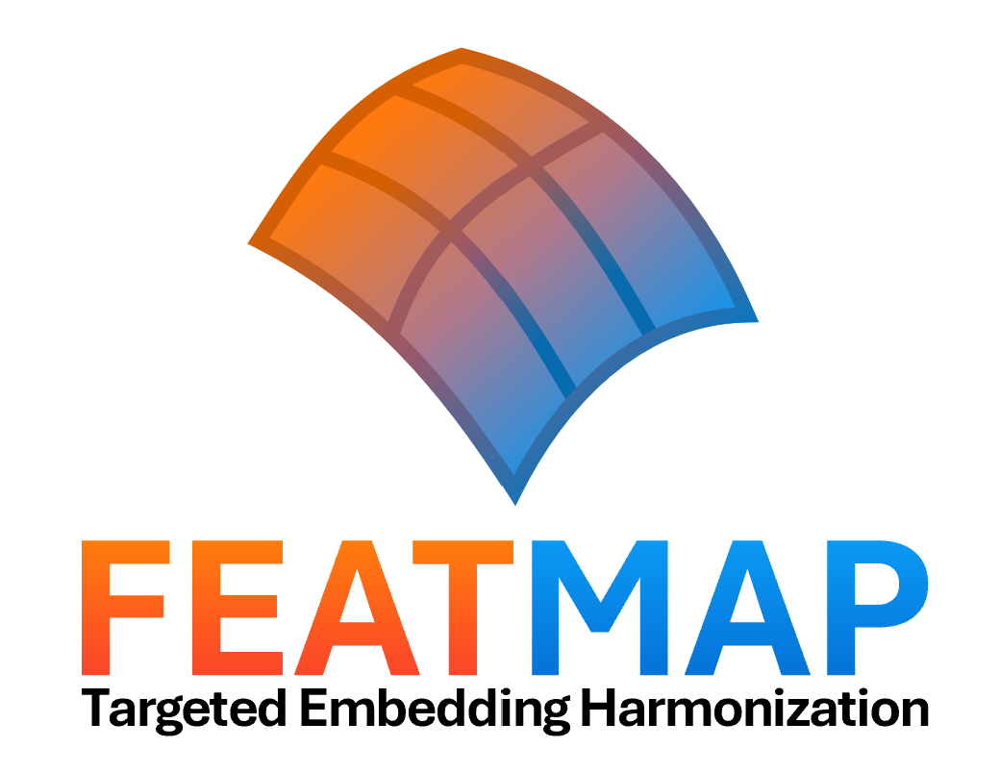

<p align="center">
  
</p>

# FEATMAP

FEATMAP learns and applies affine transformations between medical foundation-model embedding spaces.

**Paper:** [FEATMAP: Targeted Correction of Acquisition Signatures Harmonizes Medical Foundation Model Embeddings and Enables Robust Task Generalization](https://www.biorxiv.org/content/10.64898/2026.07.02.736184v1)  
**bioRxiv DOI:** [10.64898/2026.07.02.736184](https://doi.org/10.64898/2026.07.02.736184)

## What is included

FEATMAP provides two general functions:

```python
train_FEATMAP(...)
apply_FEATMAP(...)
```

and three convenience functions for the provided FEATMAP transformation matrices:

```python
harmonize_scanner(...)
harmonize_foundation_model(...)
harmonize_field_strength(...)
```

The provided collection contains 142 transformation matrices:

- 60 scanner transformations: all directed pairs of 4 scanners for each of 5 pathology foundation models.
- 80 foundation-model transformations: all directed pairs of 5 foundation models for each of 4 scanners.
- 2 MRI field-strength transformations: `1p5t -> 3t` and `3t -> 1p5t` using 768-dimensional BrainIAC embeddings.

## Requirements

```text
numpy>=1.24
torch>=2.0
```

## Download the pretrained FEATMAP transformation matrices

The pretrained FEATMAP transformation matrices are distributed separately from the GitHub source code as a ZIP archive on Zenodo.

1. Download `featmap_pretrained_transformation_matrices.zip` from the FEATMAP Zenodo record: [10.5281/zenodo.22692768](https://doi.org/10.5281/zenodo.22692768).
2. Unpack the ZIP inside the `featmap/` directory.
3. Keep the `.pt` filenames unchanged.

After unpacking, the repository should contain:

```text
FEATMAP/
├── README.md
├── examples/
└── featmap/
    ├── __init__.py
    ├── core.py
    ├── helpers.py
    ├── manifest.json
    └── transformation_matrices/
        └── ... 142 .pt files
```

`manifest.json` lists all 142 transformation matrices and their expected input/output dimensions. FEATMAP does not download them automatically.

## Train your own FEATMAP transformation

Training requires **paired embeddings**. Row `i` in the source embeddings must represent the same biological observation as row `i` in the target embeddings.

```python
from featmap import train_FEATMAP
import torch

transformation_matrix = train_FEATMAP(
    source_embeddings,
    target_embeddings,
)

torch.save(transformation_matrix, "my_FEATMAP_transformation_matrix.pt")
```

Training accepts NumPy arrays or PyTorch tensors. The returned transformation matrix is a CPU `torch.float64` tensor. Source and target embedding dimensions do not need to be the same.

## Apply a FEATMAP transformation

```python
from featmap import apply_FEATMAP
import torch

transformation_matrix = torch.load(
    "my_FEATMAP_transformation_matrix.pt",
    map_location="cpu",
)

harmonized_embeddings = apply_FEATMAP(
    embeddings,
    transformation_matrix,
)
```

`apply_FEATMAP` accepts NumPy arrays or PyTorch tensors. The output type follows the input embedding type.

## Harmonize scanner embeddings

Use the short names exactly as listed below.

```python
from featmap import harmonize_scanner

harmonized_embeddings = harmonize_scanner(
    embeddings,
    source_scanner="at2",
    target_scanner="gt450",
    foundation_model="uni",
)
```

Supported scanners:

- `at2` — Aperio AT2
- `gt450` — Aperio GT450
- `vs200` — Olympus VS200
- `ocus40` — Grundium Ocus 40

Supported pathology foundation models and embedding dimensions:

- `conch` — CONCH, 512 dimensions
- `uni` — UNI, 1024 dimensions
- `virchow2` — Virchow2, 2560 dimensions
- `hoptimus0` — H-Optimus-0, 1536 dimensions
- `gigapath` — Prov-GigaPath, 1536 dimensions

## Harmonize foundation-model embeddings

```python
from featmap import harmonize_foundation_model

harmonized_embeddings = harmonize_foundation_model(
    embeddings,
    source_model="uni",
    target_model="conch",
    scanner="gt450",
)
```

Input and output embedding dimensions may differ because different foundation models have different embedding sizes.

## Harmonize MRI field-strength embeddings

```python
from featmap import harmonize_field_strength

harmonized_embeddings = harmonize_field_strength(
    embeddings,
    source_field_strength="1p5t",
    target_field_strength="3t",
)
```

The field-strength transformations use 768-dimensional BrainIAC embeddings. The supported field-strength names are `1p5t` and `3t`.

## Examples

The `examples/` directory contains small runnable examples that create random synthetic vectors to demonstrate how the functions work. The random vectors are only for illustrating function usage and are not meaningful medical embeddings.

Run the training/application example from the repository root:

```bash
python examples/train_and_apply.py
```

After downloading the provided transformation matrices, run:

```bash
python examples/harmonize_with_transformation_matrices.py
```